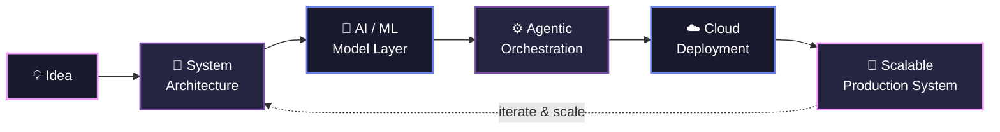

Readme · MD

       

  

Show Image Show Image Show Image

   <!-- ================= ABOUT ================= -->
🧬 About Me

💻 Software Engineer — Crafting robust, maintainable backend software and scalable system architectures with Python
🤖 AI Infrastructure & Systems — Bridging clean code principles with modern Machine Learning and Agentic AI deployment
☁️ Future Cloud Architect — Building strong fundamentals in Cloud Computing, distributed networks, and DevOps workflows
🔬 Primary Stack & Focus — Async backends with Python, FastAPI & PostgreSQL • RESTful API Design • Redis Caching • Distributed Systems
🛠️ Currently Building — Agentic ML Workflows & Intelligent Automation Tools
⚡ Fun Fact — I break systems in CTF labs to understand how to build resilient software in production
   

## 🏗️ My Engineering Philosophy

 

## 🛠️ Tech Stack

### 💻 Software Engineering & Core Backend

### 🤖 AI Engineering & Agentic Frameworks

### ☁️ Cloud & Infrastructure (AWS Focus)

### 🔐 Application & Cloud Security

### 🔧 Developer Tools & Environment

 

## 📈 GitHub Analytics

 

 

## 📬 Let's Connect & Build Something

  

