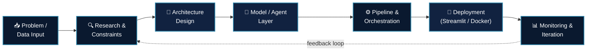

<div align="center">


<br/>


</div>

<br/>

## 🧠 `whoami`

```yaml
engineer:
  name: "Talha"
  role: "AI Engineer / Data Science & Math Student"
  focus: ["Generative AI", "Agentic Systems", "Applied ML"]
  currently_learning: ["Advanced Agentic AI", "NLP", "Offensive Security"]
  philosophy: "Think in systems — data flow, failure modes, and scale — before writing a single line of code."
  ask_me_about: ["Python", "Streamlit", "LangChain", "Linux"]
  fun_fact: "I debug production code and CTF labs with the same energy 🎯"
```

<br/>

## 🏗️ How I Approach a Problem — System Design Mindset

<div align="center">



*I treat every project like a system: inputs, boundaries, failure modes, and feedback loops — not just a notebook that runs once.*

</div>

<br/>

## 🛠️ Tech Stack & Tools

<div align="center">

**🐍 Languages & Core**


**🤖 AI / ML & Agentic Systems**


**📊 Data**


**⚙️ Tools & Environment**


**🔐 Security**


</div>

<br/>

## 📈 GitHub Analytics

<div align="center">


</div>

<br/>

## 🏆 GitHub Trophies

<div align="center">


</div>

<br/>

## 📬 Connect With Me

<div align="center">

<a href="https://linkedin.com/in/YOUR_LINKEDIN_USERNAME" target="_blank">
  
</a>
<a href="mailto:YOUR_EMAIL@example.com">
  
</a>
<a href="https://github.com/TALHA-ABDUL-RAUF" target="_blank">
  
</a>

<br/><br/>


</div>
