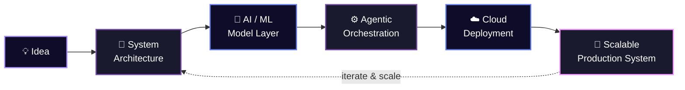

<div align="center">


<br/>


<br/><br/>

<a href="https://www.linkedin.com/in/talha-abdul-rauf-771031347/">

</a>
<a href="https://github.com/TALHA-ABDUL-RAUF">

</a>


</div>

<br/>


## 🧬 About Me

<table>
<tr>
<td width="60%" valign="top">

```yaml
engineer:
  name: "Talha Abdul Rauf"
  role: ["Software Engineer", "AI Systems Builder", "Cloud Enthusiast"]

  focus:
    backend: "Async Python services with FastAPI & PostgreSQL"
    ai_systems: "Agentic ML workflows & LLM orchestration"
    cloud: "AWS fundamentals, Docker, distributed architectures"

  currently_building: "Intelligent automation tools powered by agents"
  currently_learning: "Cloud-native architecture at scale"

  fun_fact: >
    Breaks systems in CTF labs to understand
    how to build resilient software in production
```

</td>
<td width="40%" valign="top" align="center">


<br/>


</td>
</tr>
</table>

<br/>

## 🏗️ Engineering Philosophy

<div align="center">



</div>

<br/>

## 🛠️ Tech Stack

<div align="center">

**Software Engineering & Core Backend**
<br/>


<br/>

**AI Engineering & Agentic Frameworks**
<br/>


<br/>

**Cloud & Infrastructure**
<br/>


<br/>

**Security**
<br/>


<br/>

**Developer Tools**
<br/>


</div>

<br/>


## 📈 GitHub Analytics

<div align="center">


<br/>


<br/>


</div>

<br/>

## 🏆 GitHub Trophies

<div align="center">


</div>

<br/>

## 🐍 Contribution Snake

<div align="center">


</div>

<br/>


## 📬 Let's Connect & Build Something

<div align="center">

<a href="https://www.linkedin.com/in/talha-abdul-rauf-771031347/" target="_blank">
  
</a>
<a href="https://github.com/TALHA-ABDUL-RAUF" target="_blank">
  
</a>

<br/><br/>

<i>"From idea to production — I build systems that think, scale, and last."</i>

<br/><br/>


</div>
