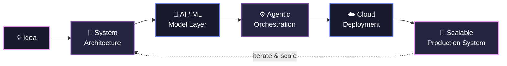

  

 

## 🧬 About Me

- 🤖 **AI Engineer & Software Engineer** — I design and ship systems where machine learning meets real production infrastructure
- 🏛️ **Future AI Architect** — evolving from building models to architecting the platforms, pipelines, and cloud systems that run them at scale
- ☁️ Deep diving into **Cloud Computing**, distributed systems, and scalable AI infrastructure
- 🔭 Currently building **Generative AI & Agentic ML systems**
- 🌱 Leveling up in **Advanced Agentic AI, LLM Orchestration, NLP & Offensive Security**
- 💬 Ask me about **Python, LangChain, Streamlit, Cloud Deployments & Linux**
- ⚡ Fun fact: **I break systems in CTF labs and rebuild them better in production**

 

## 🏗️ My Engineering Philosophy

*I don't just train models — I architect the systems around them: scalable pipelines, cloud infrastructure, and agentic orchestration that turn an idea into a production-grade product.*

 

## 🛠️ Tech Stack

### 🤖 AI / ML / Agentic Engineering

### ☁️ Cloud & Infrastructure

### 💻 Languages & Core Engineering

### 📊 Data

### 🔧 Tools & Environment

### 🔐 Security

 

## 📈 GitHub Analytics

 

## 🏆 GitHub Trophies

 

## 📬 Let's Connect & Build Something

  

